# 📊 Dashboard de Gestão de Horas Extras — SUNEG / GERAS

Pipeline de **ETL** em Python e dashboard analítico em Power BI para acompanhamento, projeção e redução do passivo de horas extras (banco de horas) de uma rede de agências.

> ⚠️ **Sobre os dados:** este repositório não contém dados reais de colaboradores. Nomes e matrículas nas imagens foram substituídos por identificadores fictícios. O código do pipeline é de uso interno e não está publicado; este repositório documenta a solução e o dashboard.

---

## 📑 Sumário

- [Sobre o projeto](#-sobre-o-projeto)
- [Arquitetura](#-arquitetura)
- [Pipeline de ETL](#-pipeline-de-etl)
- [O dashboard](#-o-dashboard)
- [Regras de negócio e métricas](#-regras-de-negócio-e-métricas)
- [Tecnologias](#-tecnologias)
- [Privacidade e LGPD](#-privacidade-e-lgpd)
- [Autor](#-autor)

---

## 🎯 Sobre o projeto

O acúmulo de horas extras gera passivo trabalhista e risco à saúde ocupacional. Este projeto entrega:

1. Um **pipeline de ETL** que consolida os relatórios mensais de ponto (vários arquivos Excel, um por polo/competência), trata e padroniza os dados, cruza com a estrutura de agências e o cadastro de funcionários e gera uma base única pronta para análise.
2. Um **dashboard** que transforma essa base em indicadores acionáveis para gestores de agências e polos: quem deve folgar, onde o passivo se concentra e se a tendência aponta para a meta de **zerar os saldos**.

O ciclo anual do banco de horas encerra em **agosto**, com novo ciclo iniciando em **setembro**.

---

## 🏗️ Arquitetura

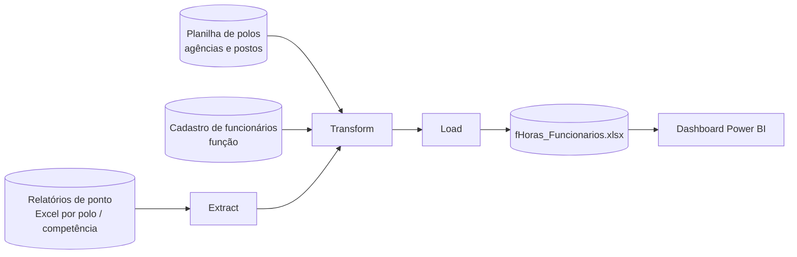

---

## 🔄 Pipeline de ETL

Implementado em Python (orientado a objetos, uma classe por processo), com logs de validação em cada etapa.

### 1. Extract

- Varre recursivamente a pasta de origem e lê todos os arquivos `.xlsx` de horas acumuladas.
- Suporta **dois formatos de origem**: arquivos individuais (formato antigo) e o arquivo unificado com **uma aba por polo**.
- Lê o cabeçalho de cada arquivo/aba para capturar o período (`Data_Inicio` e `Data_Fim`) e anexa às linhas.
- Erros de leitura em um arquivo ou aba são registrados e não interrompem o processamento dos demais.

### 2. Transform

| Tratamento | Descrição |
|------------|-----------|
| **Limpeza de matrícula** | Corrige o artefato de exportação do Excel (`_x003X_`) que substitui dígitos. |
| **Padronização da unidade** | Extrai o nome da agência/posto do campo de lotação (removendo prefixos como `#AG`, `#PA`, `#POSTO`), remove acentos, normaliza espaços e caixa. |
| **Dicionário de correções** | Mapeia variações de nome do sistema de ponto para o nome oficial da planilha de polos. |
| **Cruzamento com a estrutura** | Une agências **e postos de atendimento** à planilha de polos, herdando código, polo, nível e município da agência-mãe. |
| **Alerta de não mapeados** | Lista no log os registros sem agência/polo para que o dicionário seja atualizado. |
| **Saldo de horas** | Converte o saldo para `timedelta`, trata sinais duplicados (`--`), classifica crédito/débito (`C`/`D`) e gera horas inteiras, minutos, formato `hh:mm` e valor decimal. |
| **Função e jornada** | Cruza com o cadastro de funcionários; aplica função padrão quando ausente e define a **jornada contratual (6h ou 8h)** pelo cargo. |
| **Dias de folga** | Converte o saldo em dias: `horas / jornada`. |

### 3. Load

Exporta a base consolidada `fHoras_Funcionarios.xlsx` com colunas em ordem padronizada (unidade, polo, nível, matrícula, função, jornada, saldo, dias de folga, período etc.), que alimenta o dashboard.

---

## 🖥️ O dashboard

### Filtros e indicadores macro

Segmentadores por **Agência e Polo**, **Funcionário**, **Data (competência)** e **Carga Horária**, seguidos dos cartões de Soma Total de Crescimento, Média de Crescimento, Meta a Reduzir no Mês, Estimativa Final do Período, Total de Funcionários e Saldo Total Atual.

<p align="center">
  <br><br>
  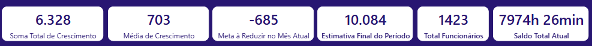
</p>

### Painel operacional: zerar horas extras

Visão nominal do passivo de cada colaborador, com saldo, jornada, **dias de folga** (barras de dados), **status de risco** e cargo, para que o gestor planeje folgas e compensações.

<p align="center">
  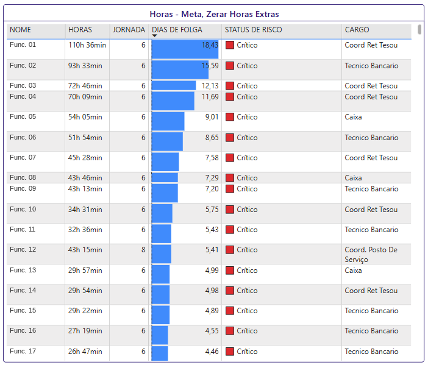
</p>

### Visão por polo e por função

Mostra onde o passivo se concentra regionalmente e em quais carreiras (ex.: Caixas e Técnicos Bancários), apoiando auditorias e o dimensionamento de equipes.

<p align="center">
  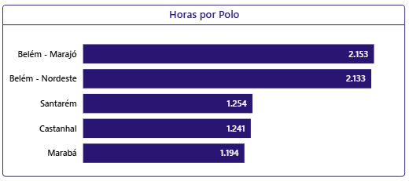
  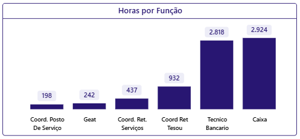
</p>

### Visão por agência e provisionamento

Ranking de acúmulo por unidade e, por funcionário, a divisão entre **60% a pagar em folha** e **40% mantido no banco de horas**.

<p align="center">
  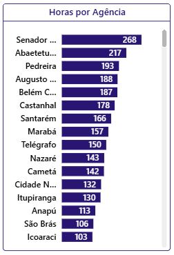
  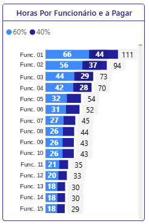
</p>

### Participação percentual e evolução temporal

Peso relativo de cada unidade no passivo total e trajetória mensal do saldo ao longo do ciclo.

<p align="center">
  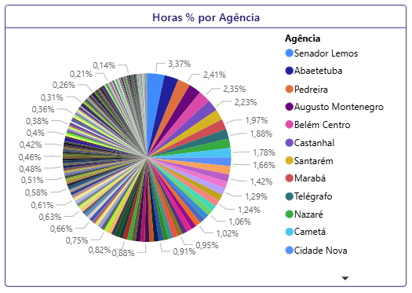<br><br>
  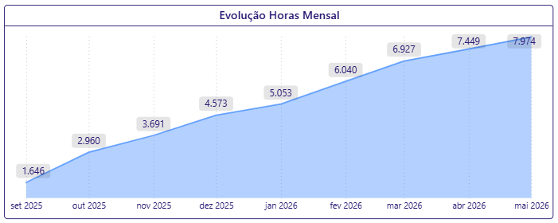
</p>

### Crescimento × Aceleração

Monitora não só o volume, mas o *ritmo* de variação do passivo.

<p align="center">
  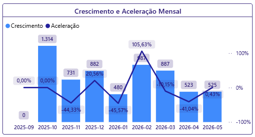
</p>

### Índice de Qualidade

Ranking das agências do maior para o menor risco, com a posição do mês anterior e seta de tendência.

<p align="center">
  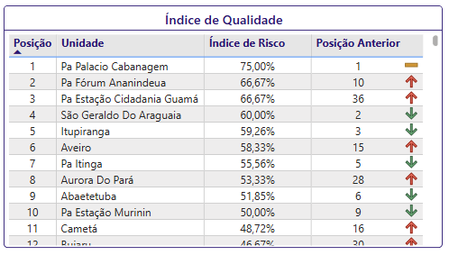
</p>

---

## 📐 Regras de negócio e métricas

> Os indicadores abaixo são calculados na camada do dashboard, a partir da base gerada pelo ETL.

### Indicadores dos cartões

| Métrica | Fórmula |
|---------|---------|
| **Crescimento mensal** | `Saldo do mês atual − Saldo do mês anterior` |
| **Soma Total de Crescimento (STC)** | Soma dos crescimentos mensais do período |
| **Média de Crescimento** | `STC / Total de meses` |
| **Abatimento sutil** | `Saldo Total Atual × 0,02` |
| **Meta a Reduzir no Mês** | `(Crescimento mais recente + Abatimento sutil) × (−1)` |
| **Estimativa Final do Período** | `Média de Crescimento × Nº de meses restantes até agosto` |
| **Total de Funcionários** | Contagem distinta de colaboradores ativos na competência |

### Dias de folga

$$\text{Dias de Folga} = \frac{\text{Horas Acumuladas}}{\text{Jornada}}$$

### Matriz de status de risco

| Status | Jornada 6h | Jornada 8h | Ação operacional |
|--------|-----------|-----------|------------------|
| Devendo | < 0 h | < 0 h | – |
| Saudável | 0 h a 6 h | 0 h a 8 h | Operacional |
| Apto para folga | 6 h a 12 h | 8 h a 14 h | Acúmulo entre 1 e 2 dias; requer planejamento de folga |
| Folga obrigatória | 12 h a 18 h | 14 h a 22 h | Acúmulo excessivo; folgas obrigatórias em até 30 dias |
| Crítico | > 18 h | > 22 h | Ação de redução imediata |

### Crescimento × Aceleração

Analogia: o **saldo** é a quilometragem total, o **crescimento** são os km rodados no mês e a **aceleração** é a pressão no pedal.

```
Crescimento Anterior = Saldo(M-1) − Saldo(M-2)
Crescimento Atual    = Saldo(M0)  − Saldo(M-1)
Aceleração           = Crescimento Atual − Crescimento Anterior
```

**Exemplo:** saldo de 1.000 h (nov) → 1.200 h (dez, +200 h) → 1.600 h (jan, +400 h). A aceleração é de **+100%**: o problema dobrou de velocidade, mesmo que o saldo "apenas" tenha crescido.

### Índice de Risco da Agência

| Status | Pontos |
|--------|:------:|
| Devendo / Saudável | 0 |
| Apto para folga | 1 |
| Folga obrigatória | 2 |
| Crítico | 3 |

$$RMP = N \times 3 \qquad RA = \sum_{i=1}^{N} \text{Pontuação}_i \qquad IRA = \frac{RA}{RMP} \times 100$$

**Exemplo:** agência com 3 funcionários (0 + 2 + 3 pontos): `RA = 5`, `RMP = 9`, `IRA ≈ 55,56%`.

### Provisionamento (Horas por Funcionário e a Pagar)

- **60%**: parcela passível de indenização em folha no mês de competência.
- **40%**: remanescente incorporado ao banco de horas para compensação futura.

---

## 🛠️ Tecnologias

- **Python**: pandas, numpy, openpyxl
- **Power BI**: modelagem, medidas DAX e visualizações
- **Excel**: fontes de dados e base analítica
- Git e GitHub

---

## 🔒 Privacidade e LGPD

Por envolver dados de pessoal, este repositório **não publica** dados reais. Nomes e matrículas foram substituídos por identificadores fictícios e o código do pipeline, que referencia caminhos e cadastros internos, permanece privado.

---

## 👤 Autor

**Seu Nome**
[LinkedIn](https://www.linkedin.com/in/seu-perfil) · [GitHub](https://github.com/seu-usuario)
